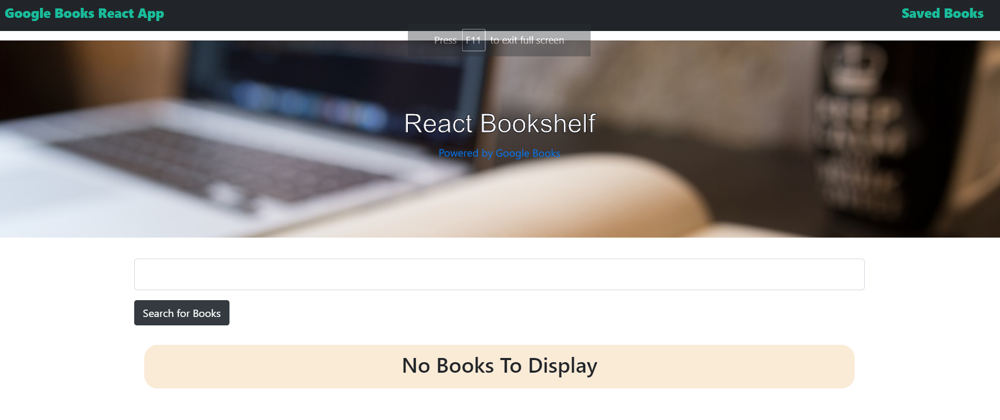
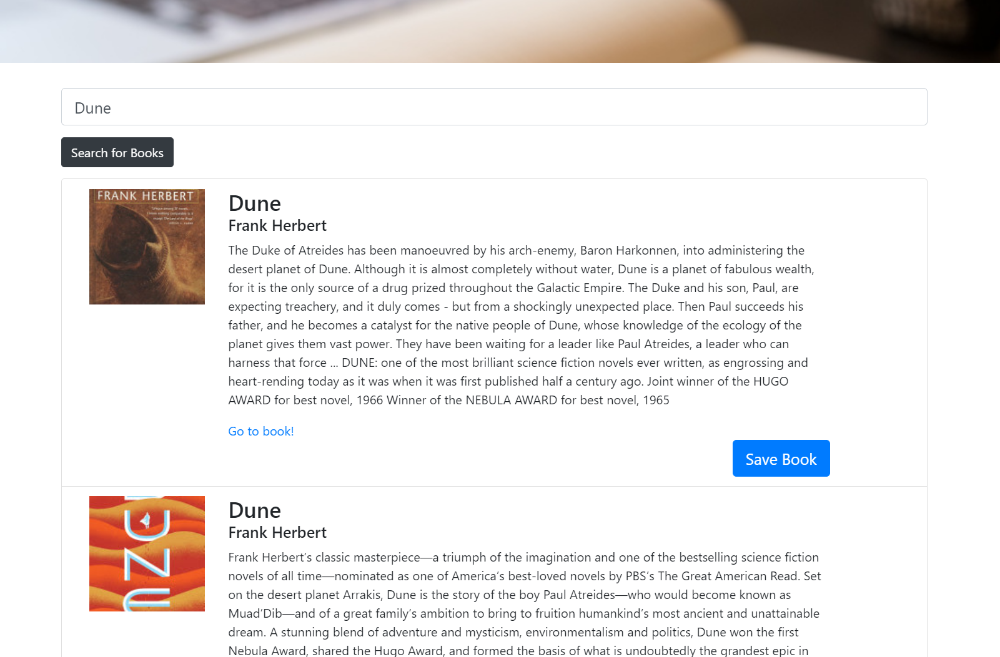
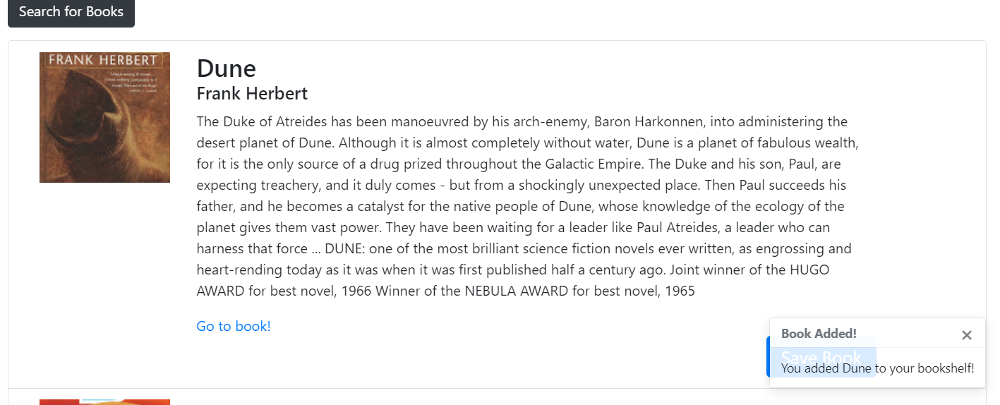
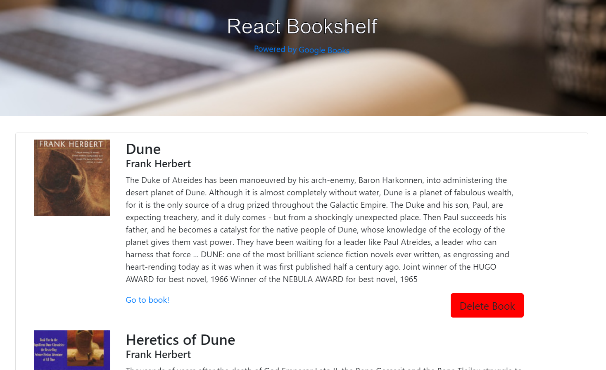

# Google Bookshelf

## About
This app was built in React and uses some ES6 features for the logic. Uses MongoDB, state, and props in React!

## To Use
Search for books on Google Books, save them if you want for later! Saves a thumbnail, description, and a link to the book as well!

***

***

***

***

## Tech Used
* React w/ state
* CSS
* ReactStrap
* JavaScript

## Todos
- More styling